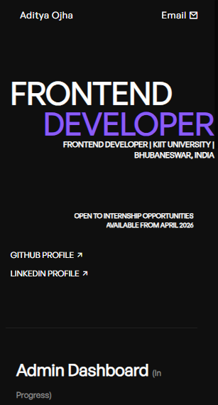

# 🚀 Aditya Ojha - Portfolio Website

A modern, responsive and animated personal portfolio website built using **HTML, CSS, JavaScript, GSAP and Locomotive Scroll**.

This project showcases my frontend development skills, projects and contact information with smooth animations and a clean UI.

---

## 🌐 Live Demo

👉 https://aditya-portfolio-seven-rho.vercel.app/

---

## 📸 Preview

<p align="center">
  
  &nbsp;&nbsp;&nbsp;&nbsp;
  
</p>

---

## ✨ Features

* 🎯 Modern dark UI
* ⚡ Smooth scrolling using Locomotive Scroll
* 🎬 GSAP powered animations
* 🖱️ Custom animated cursor
* 📱 Fully responsive design
* 🧩 Project showcase section
* 📬 Contact section
* 🎨 Clean and minimal layout

---

## 🛠️ Tech Stack

* HTML5
* CSS3
* JavaScript (Vanilla JS)
* GSAP
* Locomotive Scroll
* Vercel (Deployment)

---

## 📂 Project Structure

```
├── index.html
├── style.css
├── loco.css
├── script.js
└── assets/
```

---

## 🚀 Getting Started

### 1️⃣ Clone the repository

```bash
git clone https://github.com/aditya-ojha-dev/your-repo-name.git
```

### 2️⃣ Open in browser

Simply open `index.html` in your browser.

---

## 👨‍💻 About Me

I am a Frontend Developer passionate about building responsive and interactive web applications. Currently pursuing B.Tech at **KIIT University, Bhubaneswar**.

* 💼 Open to Internship Opportunities
* 📅 Available from April 2026

---

## 📬 Contact

* 📧 Email: [adi27ojha@gmail.com](mailto:adi27ojha@gmail.com)
* 💼 LinkedIn: https://linkedin.com/in/adityaojha27
* 🐙 GitHub: https://github.com/aditya-ojha-dev

---

## ⭐ If you like this project

Give it a ⭐ on GitHub — it motivates me to build more!
